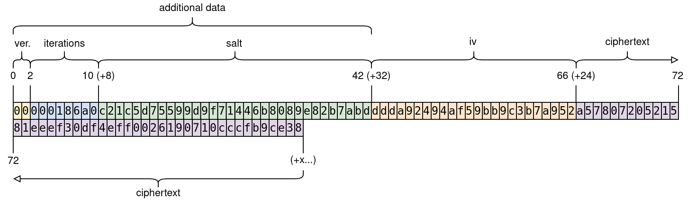

Svanill
=============

An easily auditable tool to encrypt/decrypt your sensitive data.

[One file](./svanill.html), no dependencies. If you trust the browser internals you just have to audit this file.

It's small, you can either use it from [https://svanill.com](https://svanill.com) (and review it every time) or keep your own copy.

Even without a network connection it will allow you to encrypt/decrypt data on your device.

If you provide a username you will be able to sync your encrypted data with an external server (by default [https://api.svanill.com](https://api.svanill.com), an instance of [svanill-vault-server](https://github.com/svanill/svanill-vault)). Without it no network requests will be sent.
Eventually a version of Svanill without network code will be done.
By the way, don't trust the external server for privacy, verify that Svanill will just send encrypted data that can be secure at rest, that's the point of having auditable code.

How to run
==========

Open [svanill.html](./svanill.html) on a browser.

How to run the tests
====================

```
# unit tests
yarn test-unit

# e2e tests (requires `docker-compose`)
yarn test-e2e
```

Goals
=====

- have the means to manage secrets
- must be open source
- it must be a standalone program or work on an recent browser
- it must be portable (Linux, Windows, Android, macOS, ...)
- it must not use external dependencies  
  (or at least it must work in a sandboxed environment - no network, no filesystem, no ipc...)
- the source code must be easily auditable by one person in a short time
- any optional outgoing network requests must send data encrypted client-side

Non goals
=========
- write the smallest possible file sacrificing documentation or readability
- give the ability to upload to more than one external service at once

Undecided goals
===============
- store binary files
- handle multiple files

Use cases
=========
- You don't trust any software without reviewing it yourself, at every update
- You really need to use someone else's computer (you feel ok to open your data on a browser - possibly incognito mode, no extensions)
- You want to share something privately, passing the password on a different channel

Encryption
==========

Content is secured by a symmetric encryption algorithm, using AES-GCM.

The primitives used come directly from the browser (`crypto.subtle` and `crypto.getRandomValues`).

The key is derived using PBKDF2-HMAC-SHA-256, 100.000 iterations.

The size of the iv/nonce is 96 bit, randomly generated before any encryption.

The salt is 128 bit long, randomly generated before any encryption.

Random data is obtained through [crypto.getRandomValues](https://developer.mozilla.org/en-US/docs/Web/API/RandomSource/getRandomValues) (its PRNG is suitable for cryptographic purposes).

Everything but the key is prepended to the ciphertext and thus public. 

The data must be secure at rest, so the strength of the key is what matters most.
You should [use the longest passphrase](https://en.wikipedia.org/wiki/Password_strength) you are confident to remember (assuming just english letters and digits, it should be at least 14 characters long - around 72 bit of entropy).



Here it's encrypted the text `svanill` using `foobar` as password. Note that this particular password is weak (short and guessable), used just for the sake of example.

To decrypt we read the first byte to determine how the rest of the bytes are aligned, and use them to decrypt. If somehow the data got tampered we won't be able to decrypt.
Since we are not communicating with an external party during decryption there should be no timing attack.

To protect against a purposefully crafted high iteration number, which would starve the cpu, Svanill won't attempt to decrypt if that number is higher than what we use to encrypt.

Nothing from decryption is reused for future encryption, to prevent downgrade attacks or blatant compromissions (like reusing the iv).

## Wouldn't Argon2 be better than PBKDF2?

It's not really an option, Argon2 is not part of the Web Cryptography API.

## What about libsodium?

It would be an external dependency, pretty much inscrutable and requiring to verify its authenticity. I decided not to give the user the burden to verify the signatures. I also liked the idea of a self-contained program that could work without network requests.

F.A.Q.
======

## Will the browser cache my data?

No, but but you should use private browsing nonetheless.

## Can I trust my browser?

That's a difficult question. If you don't, you shouldn't use it to navigate the Internet. The highest risks are when you are using an outdated browser and when you're using browser extensions. If you want to be at ease you should use an updated browser and open Svanill from a profile without extensions, in private mode (even moreso if you're using someone else's computer).

## Why you think that this kind of software should be open source?

Because you should be able to check if the original code or any later update contains malicious operations or bugs, and be able to act accordingly.
Even if I would deem secure a particular version, every update could contain malicious code (e.g. the company has been acquired by EvilCorp or forced by a powerful entity) or may contain bugs which I would not be able to neither detect nor fix, letting me open to attacks until a new update arrive (if ever).
Even if the software is audited by a third party it usually doesn't mean that every single update is audited.

## Does it work without an Internet connection?

Yes, you could keep a local copy to encrypt/decrypt data (you would not be able to sync online of course).

## Alternative programs

These programs do not really match the goals of Svanill and offer so much more, but they come up anyway in questions, so here they are.

- **Bitwarden**  
 Impressive product, they open source everything from mobile app to website vault.
 It just doesn't match our goals.

- **Enpass**  
 Very interesting product. Standalone support, truly comprehensive cross-platform versions, stores the data using SQLCipher (which is open source) and never stores your data online.
 Doesn't match our goals.

- **Lastpass / 1Password**  
 Both are closed source and not freely auditable by an independent external auditor.
 1Password in particular has never had first class support for Linux.

- **Keypass**  
 Too big to audit for a solo developer. Keypass 1.x was audited, but Keypass 2.x was not and, cit. keypass.info, "They are fundamentally different". No official/audited Android application.
 Yet it's respected and full featured if that's what you're searching for.

- **pass**  
 Requires to keep around a gpg private key. No official/audited Android application.

License
=======

Svanill, an easily auditable tool to encrypt/decrypt your sensitive data.
Copyright (C) 2017 Riccardo Attilio Galli

This program is free software: you can redistribute it and/or modify
it under the terms of the GNU Affero General Public License as published by
the Free Software Foundation, either version 3 of the License, or
(at your option) any later version.

This program is distributed in the hope that it will be useful,
but WITHOUT ANY WARRANTY; without even the implied warranty of
MERCHANTABILITY or FITNESS FOR A PARTICULAR PURPOSE.  See the
GNU Affero General Public License for more details.

You should have received a copy of the GNU Affero General Public License
along with this program.  If not, see <http://www.gnu.org/licenses/>.
