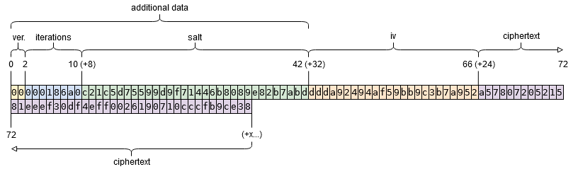

Svanill
=============

An easily auditable tool to encrypt/decrypt your sensitive data.

[One file](./svanill.html), no dependencies. If you trust the browser internals you just have to audit this file.

It's small, you can either use it from [https://svanill.com](https://svanill.com) and review it every time or keep your own copy.

Even without a network connection it will allow you to encrypt/decrypt data on your device. If you want to keep your encrypted data on an external server you can either use the default [https://svanill.com](https://svanill.com) - the option appears if you provide a username - or edit the file and point at your own server.

How to run
==========

Open [svanill.html](./svanill.html) on a browser.

How to run the tests
====================

```
# unit tests
yarn test-unit
```

```
# e2e tests networkless (encrypt/decrypt interface, no sync)
yarn test-e2e-networkless-chrome
yarn test-e2e-networkless-firefox
```

```
# e2e tests with network api (login, upload, reload)
yarn setup-network-env
yarn test-e2e-network-api-chrome
yarn test-e2e-network-api-firefox
yarn teardown-network-env
```

Goals
=====

- have the means to manage secrets
- it must be a standalone program or work on an recent browser
- it must be portable (Linux, Windows, Android, macOS, ...)
- it must not use external dependencies
- (alternatively it must work in a sandboxed environment - no network, no filesystem)
- the source code must be easily auditable by one person in a short time
- any optional outgoing network requests must send data encrypted client-side

Non goals
=========
- write the smallest possible file sacrificing documentation or readability
- give the ability to upload to more than one external service at once

Undecided goals
===============
- store binary files
- handle multiple files

Use cases
=========
- You don't trust any software without reviewing it yourself, at every update
- You need to use someone else's computer (you feel ok to open your data on a browser - possibly incognito mode, no extensions)
- You want to share something privately, passing the password on a different channel

F.A.Q.
======

## How is content encrypted?

Content is encrypted using AES-GCM. The size of the iv/nonce is 96 bit, generated by [window.crypto.getRandomValues](https://developer.mozilla.org/en-US/docs/Web/API/RandomSource/getRandomValues) (the PRNG is suitable for cryptographic usages).
The key is derived using PBKDF2-HMAC-SHA-256, 100.000 iterations.
The salt is 16 byte long, generated randomly before any encryption.
Salt and iterations are not kept secret, they are part of the additional data of the produced ciphertext.



Here I encrypted the text `svanill` using `foobar` as password. Note that this particular password is weak (short and guessable), used just for the sake of example.
You should [use the longest passphrase](https://en.wikipedia.org/wiki/Password_strength) you are confident to remember (assuming just english letters and digits, it should be at least 14 characters long - around 72 bit of entropy).

## Why PBKDF2 instead of Argon2?

Argon2 is not part of the Web Cryptography API.

## What about libsodium?

It would require an external dependency, pretty much inscrutable and requiring to verify its authenticity.

## Alternative programs

These programs do not really match the goals of Svanill, but they come up anyway in questions, so here they are.

- **Bitwarden**  
 Impressive product, they open source everything from mobile app to website vault.
 It just doesn't match our goals.

- **Enpass**  
 Very interesting product. Standalone support, truly comprehensive cross-platform versions, stores the data using SQLCipher (which is open source) and never stores your data online.
 Doesn't match our goals.

- **Lastpass / 1Password**  
 Both are closed source and not auditable by an independent external auditor.
 1Password also has never committed to a first class Linux application, and after 10 years likely never will.

- **Keypass**  
 Too big to audit for a solo developer. Keypass 1.x was audited, but Keypass 2.x was not and, cit. keypass.info, "They are fundamentally different". No official/audited Android application.
 Yet it's respected and full featured if that's what you're searching for.

- **pass**  
 Requires to keep around a gpg private key. No official/audited Android application.

License
=======

Svanill, an easily auditable tool to encrypt/decrypt your sensitive data.
Copyright (C) 2017 Riccardo Attilio Galli

This program is free software: you can redistribute it and/or modify
it under the terms of the GNU Affero General Public License as published by
the Free Software Foundation, either version 3 of the License, or
(at your option) any later version.

This program is distributed in the hope that it will be useful,
but WITHOUT ANY WARRANTY; without even the implied warranty of
MERCHANTABILITY or FITNESS FOR A PARTICULAR PURPOSE.  See the
GNU Affero General Public License for more details.

You should have received a copy of the GNU Affero General Public License
along with this program.  If not, see <http://www.gnu.org/licenses/>.
